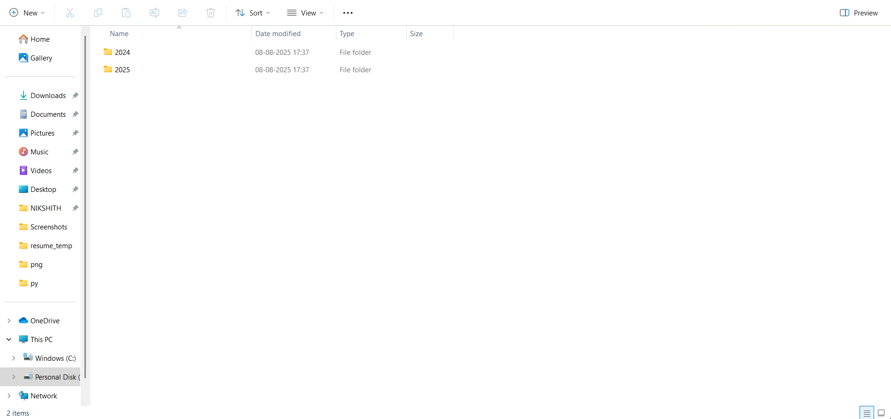
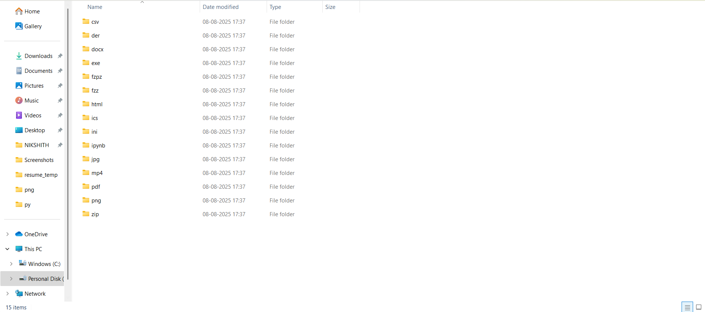

# 📂 File Organizer GUI

A simple yet powerful **File Organizer with GUI** built in Python.  
It automatically organizes files into folders based on their **file extensions** and **year**, now with an easy-to-use graphical interface.

---

## 🚀 Features
- 📁 Organizes files by **extension** into separate folders.
- 📅 Sorts files by **year** based on their last modified date.
- 🖥️ Simple **GUI interface** (Tkinter based).
- 🪟 Works on **Windows**.
- 📦 Can be converted into a standalone `.exe` using **PyInstaller**.

---

Upon running the File Organizer, your files will be sorted into folders based on the **year** they were last modified.  



---

Inside each year folder, you'll find **sub-folders** named after the file extensions found within that year.  



---

## 🛠 How to Run

### 1️⃣ Run from Python
```bash
pip install -r requirements.txt
python file_organizer_gui.py
```

### 2️⃣ Run the EXE (No Python Needed)
1. Download the latest `.exe` from [Releases](../../releases).
2. Double-click to start the GUI.

---

## 📦 Build EXE Yourself
```bash
pip install pyinstaller
pyinstaller --onefile --noconsole file_organizer_gui.py
```
The `.exe` will be in the **dist** folder.

---

## 📁 Folder Structure
```
project/
│── file_organizer_gui.py
│── README.md
│── requirements.txt
└── dist/
    └── file_organizer_gui.exe
```

---

## 📜 License
This project is licensed under the **MIT License**.

---
## 👨‍💻 Author

**Nikshith Burla**  
GitHub: [@nikshith9999](https://github.com/nikshith9999)

---

💡 *Happy Organizing!* 🎯
